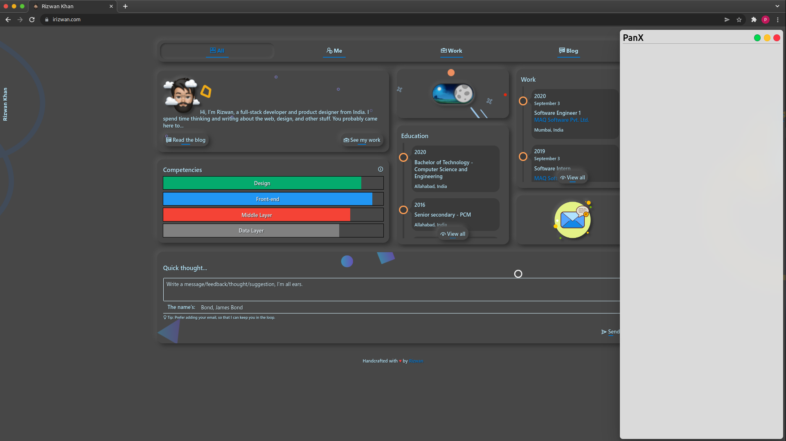
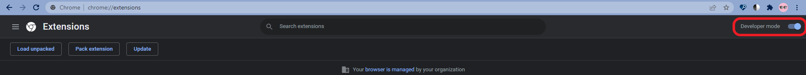

# PanX
A chrome extension boilerplate to inject an iframe panel to a webpage

## Setup

- Clone the repo or [download](https://github.com/rizz-wan/PanX/archive/refs/heads/master.zip) the .zip and extract it.

- Navigate to `chrome://extensions` in Google Chrome.

- Turn on the `Developer mode`.

- Click on `Load unpacked` and select the extension root folder.

## Appendix

- Default shortcut to launch the extension is set to `alt+shift+E`.

- The Panel features three buttons on top right corner, viz,

    - Restore button(  ): To toggle between initial size and max size of the panel.

    - Minimize button(  ): To hide and show the panel.

    - Remove button(  ): To temporarily remove the panel from the site, and will require a reload for it to be re-embedded to the site.

## Feedback

- If you find any bugs or issues please report them on the [Issue Tracker](https://github.com/rizz-wan/panX/issues).

> If you would like to contribute to this project please consider [forking this repo](https://github.com/rizz-wan/panX/fork), making your changes and then creating a new [Pull Request](https://github.com/rizz-wan/panX/pulls) back to the main code repository.